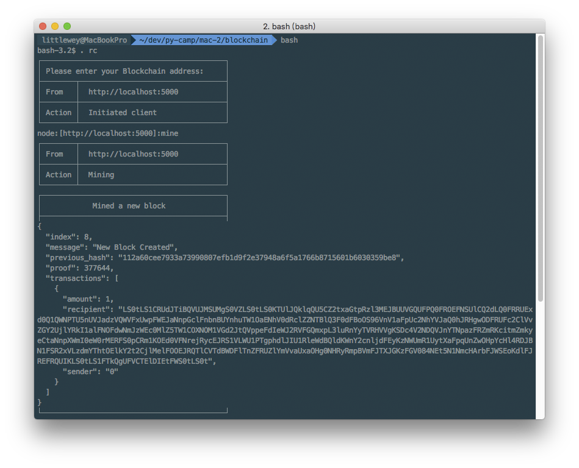
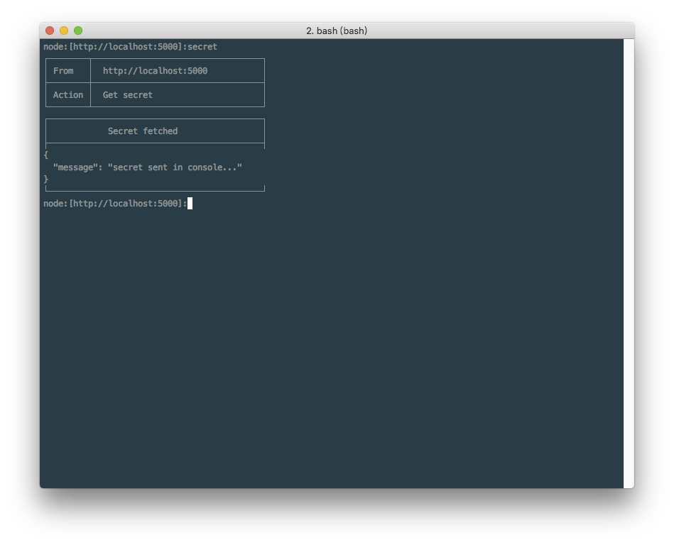
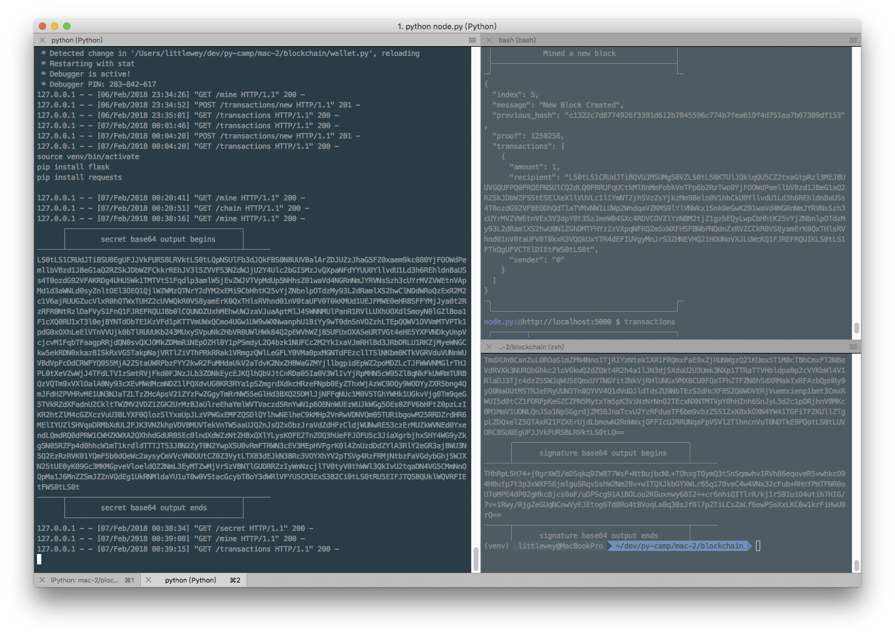
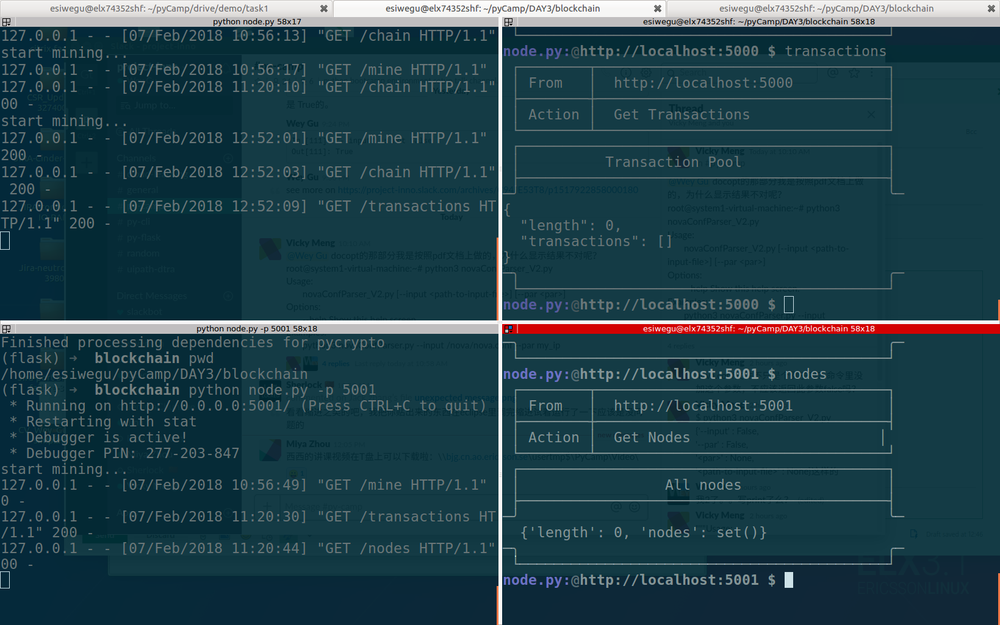

# Task 2, create a blockchain

> Our task demo is highly reusing code and even some words in https://hackernoon.com/learn-blockchains-by-building-one-117428612f46 (many thanks to the owner of that blog), but enhancements were added on top of that here.

In this task, we will create a simple part of blockchain application like `bitcoin`. 

Things we will go though:

- Some object-oriented coding (not just call class from a python module)
- http request
- flask as http api endpoints

[TOC]

## 1. What is a blockchain looks like

> ref: https://en.bitcoin.it/wiki/Technical_background_of_version_1_Bitcoin_addresses
>
> ref: https://en.bitcoin.it/wiki/Protocol_rules
>
> ref: https://www.zhihu.com/question/20941124
>
> ref: https://www.youtube.com/watch?v=Lx9zgZCMqXE

The thing here we will build is a tiny version of the very first blockchain: `bitcoin`. We could see what a `bitcoin` block looks like here: https://blockchain.info .

### 1.1 Concepts

- Block

  - Things inside:
    - index
    - hash of last block
    - timestamp
    - transactions
    - nonce
    - Things could be done:
      - hash ( to solve puzzle and output the nonce and hash value)
      - validation ( check if the chain/block is valid )
      - create new block to the chain
      - add new transaction to transaction pool

- Wallet

  - address ( a public key, for transaction verification and showing identity/ ownership )
  - secret ( a private key for signing transactions, with it you could spend/withdraw your wallet)
  - Things need to be done:
    - sign
    - verify

- node

  - broadcast and recieve other nodes broadcast to:
    - get longest valid blockchain
    - recieve transaction, verify ownership
    - send transaction
    - send mining outcome
  - transaction
  - mining
    - guess proof of work(nonce) the solve puzzle with last block on the chain and valid transactions in pool


## 2. Blueprint of the code

```bash
$ tree -L 1
.
├── blockchain.py
├── node.py
├── sigScript.py
└── wallet.py
```

### 2.1 `blockchain.py`

For blockchain, we need to implement a class with below things, and it will be called by node or so:

```python
class Blockchain:
    def __init__(self):
        self.chain = []
        self.transactionsPool = []
        
    def new_block(self):
        # build a new Block and adds it to the chain
        pass
    
    def new_transaction_by_mining(self):
        # Adds a new transaction to the list of transactions
        pass
    
    @staticmethod
    def hash(block):
        # Hashes a Block
        pass

    @property
    def last_block(self):
        # Returns the last Block in the chain
        pass
```

note, `@staticmethod` is function that need to be reused internal and external the class, which are not related to instance( the `self`), also calling it won't trigger `__init__`.

example:

```python
In [104]: class MyClass:
     ...:    def __init__(self):
     ...:       print("Initialize instance - not used")
     ...:
     ...:    @staticmethod
     ...:    def my_static(toprint):
     ...:        print(toprint)
     ...:

In [105]: MyClass.my_static("Print this")
Print this
```

note, `@property` is to make the method to be a getter, it means `blockchainInstance.last_block` could be called.

### 2.2 `wallet.py`

For wallet, we need to implement class with below things, and it will be called by node and signatureScript:

```python
class Wallet:
    def __init__(self):
        # generated a new key pair
        self.publicKey = ""
        self.privateKey = ""

    @property
    def address(self):
        return self.publicKey

    @property
    def secret(self):
        return self.privateKey

    def signature(self, hashedTransaction):
        # sign the hashedTransaction with privateKey, return the signature
        pass

    @staticmethod
    def verification(transaction, publickey, signature):
        # verify a given transaction with publickey(sender's address) and signature to verify ownership
        pass
```

### 2.3 `node.py`

For node, it's the running machine calling and being called :

- by neighbor nodes for communications
- by user for querying data/status and requesting for transactions
- by owner for mining

etc.

We used a simpfied and already known solution: http API server, provided by flask.

#### 2.3.1 Endpoints 

Endpoints to be implemented.

> Implemente them in step one

- `/mine`
- `/transactions`
- `/transactions/new`
- `/chain`

> Implemeted later

- `/nodes`
- `/nodes/register`
- `/nodes/resolve`

```python
from blockchain import Blockchain
from wallet import Wallet
from flask import Flask, jsonify, request

# Instantiate the Node
app = Flask(__name__)

# Instantiate the Wallet
wallet = Wallet()

# Instantiate the Blockchain
blockchain = Blockchain()

# endpoints

@app.route('/mine', methods=['GET'])
def mine():
    return "We'll mine a new Block"
  
@app.route('/transactions/new', methods=['POST'])
def new_transaction():
    return "We'll add a new transaction"

@app.route('/chain', methods=['GET'])
def full_chain():
    response = {
        'chain': blockchain.chain,
        'length': len(blockchain.chain),
    }
    return jsonify(response), 200

if __name__ == '__main__':
    app.run(host='0.0.0.0', port=5000)
```


### 2.4 `sigScript.py`

This is a cli tool to sign a transaction, we are going to call it by some bash client for user to request transactions. We could talk about it later together with `wallet.py` .

```python
"""
Usage:
    singnagureScript.py transaction privateKey

Options:
    --help    Show this help screen

"""
import sys
from Crypto.Hash import MD5
from wallet import Wallet

transaction, privateKey = [ argument.encode() for argument in argv[1:] ]
hashedTransaction = MD5.new(transaction)

wallet = Wallet(privateKeyB64 = privateKeyB64)
signature = wallet.signature(hashedTransaction)

print (signature)
```


## 3. Start with `blockchain.py`

### 3.1 glance of `Block`

Each Block has an *index*, a *timestamp* (in Unix time), a *list of transactions*, a *proof* (more on that later), and the *hash of the previous Block*.

Here’s an example of what a single Block looks like:

The `previous_hash` is the hash value of the block with index: `index - 1` , and that's how the chain connected and **that’s what gives blockchains immutability:** If an attacker corrupted an earlier Block in the chain then **all** subsequent blocks will contain incorrect hashes.

```python
block = {
    'index': 1,
    'timestamp': 1506057125.900785,
    'transactions': [
        {
            'sender': "8527147fe1f5426f9dd545de4b27ee00",
            'recipient': "a77f5cdfa2934df3954a5c7c7da5df1f",
            'amount': 5,
        }
    ],
    'proof': 324984774000,
    'previous_hash': "2cf24dba5fb0a30e26e83b2ac5b9e29e1b161e5c1fa7425e73043362938b9824"
}
```

### 3.2 Transaction

`self.transactionsPool` is a list of transactions to be added in next mined block. And it looks like this:

```python
{
 "sender": "my address",
 "recipient": "someone else's address",
 "amount": 5
}
```

Then method `new_transaction(self, sender, recipient, amount)` could be like this:

It actually appends a the transaction as a new `dict` to the list `transactionsPool`.

This method should be called on two conditions:

- mining 
- wallet owner (user) triggerred transaction

We'll implement that later on corresponding endpoints in `node.py`

```python
class Blockchain:
    #...
    
    def new_transaction(self, sender, recipient, amount):
        """
        Creates a new transaction to go into the next mined Block
        :param sender: <str> Address of the Sender
        :param recipient: <str> Address of the Recipient
        :param amount: <int> Amount
        :return: <int> The index of the Block that will hold this transaction
        """

        self.transactionsPool.append({
            'sender': sender,
            'recipient': recipient,
            'amount': amount,
        })

```

### 3.3 Build block

When our `Blockchain` is instantiated we’ll need to seed it with a *genesis* block—a block with no predecessors. We’ll also need to add a *proof* to our genesis block which is the result of mining (or proof of work). We’ll talk more about mining later.

In addition to creating the *genesis* block in our constructor, we’ll also flesh out the methods for `new_block()`, `new_transaction()` and `hash()`:

```python
import hashlib
import json
from time import time
from urllib.parse import urlparse

class Blockchain:
    def __init__(self):
        self.chain = []
        self.transactionsPool = []

        # Create the genesis block
        self.new_block(previous_hash=1, proof=1)
    def new_block(self, proof, previous_hash):
        """
        Create a new Block in the Blockchain

        :param proof: The proof given by the Proof of Work algorithm
        :param previous_hash: Hash of previous Block
        :return: New Block
        """

        block = {
            'index': len(self.chain) + 1,
            'timestamp': time(),
            'transactions': self.transactionsPool,
            'proof': proof,
            'previous_hash': previous_hash or self.hash(self.chain[-1]),
        }

        # Reset the pool transactions
        self.transactionsPool = []

        self.chain.append(block)
        return block
    
    def new_transaction(self, sender, recipient, amount):
        """
        Creates a new transaction to go into the next mined Block

        :param sender: Address of the Sender
        :param recipient: Address of the Recipient
        :param amount: Amount
        :return: The index of the Block that will hold this transaction
        """
        self.transactionsPool.append({
            'sender': sender,
            'recipient': recipient,
            'amount': amount,
        })

    
    @staticmethod
    def hash(block):
        """
        Creates a SHA-256 hash of a Block

        :param block: Block
        """

        # We must make sure that the Dictionary is Ordered, or we'll have inconsistent hashes
        block_string = json.dumps(block, sort_keys=True).encode()
        return hashlib.sha256(block_string).hexdigest()

    @property
    def last_block(self):
        # Returns the last Block in the chain
        pass
```

We’re almost done with representing our blockchain. But at this point, you must be wondering how new blocks are created or mined.

### 3.4 Proof of Work (nonce)

A Proof of Work algorithm (PoW) is how new Blocks are created or mined on the blockchain. The goal of PoW is to discover a number which solves a problem. The number must be **difficult to find** **but easy to verify**—computationally speaking—by anyone on the network. This is the core idea behind Proof of Work.

We’ll look at a very simple example to help this sink in.

Let’s decide that the *hash* of some integer `x` multiplied by another `y` must end in `0`. So, `hash(x * y) = ac23dc...0`. And for this simplified example, let’s fix `x = 5`. Implementing this in Python:

```python
from hashlib import sha256
x = 5
y = 0  # We don't know what y should be yet...
while sha256(str(x*y).encode()).hexdigest()[-1] != "0":
    y += 1
print("The solution is y = %d " % y)
```


The solution here is `y = 21`. Since, the produced hash ends in `0`:

```python
In [1]: sha256(str(5 * 21).encode()).hexdigest()
Out[1]: '1253e9373e781b7500266caa55150e08e210bc8cd8cc70d89985e3600155e860'
```


In Bitcoin, the Proof of Work algorithm is called [*Hashcash*](https://en.wikipedia.org/wiki/Hashcash). And it’s not too different from our basic example above. It’s the algorithm that miners race to solve in order to create a new block. In general, the **difficulty** is determined by the number of characters searched for in a string. The miners are then rewarded for their solution by receiving a coin—in a transaction.

The network is able to *easily* verify their solution.

Let's make a diffculty configuration interface, create a file called `config.py`

```python
difficulty = 4
```

Invoke it by `import`

```python
from config import difficulty
```

Let's implementing the Proof of Work code:

```python
import hashlib
import json
from time import time
from urllib.parse import urlparse
from config import difficulty

    #...
    def proof_of_work(self, last_block):
        """
        Simple Proof of Work Algorithm:

         - Find a number p' such that hash(pp') contains leading <number of difficulty> zeroes
         - Where p is the previous proof, and p' is the new proof

        :param last_block: <dict> last Block
        :return: <int>
        """

        last_proof = last_block['proof']
        last_hash = self.hash(last_block)

        proof = 0
        while self.valid_proof(last_proof, proof, last_hash) is False:
            proof += 1

        return proof
    
    @property
    def last_block(self):
        return self.chain[-1]
    
    @staticmethod
    def valid_proof(last_proof, proof, last_hash):
        """
        Validates the Proof

        :param last_proof: <int> Previous Proof
        :param proof: <int> Current Proof
        :param last_hash: <str> The hash of the Previous Block
        :return: <bool> True if correct, False if not.

        """

        guess = "".join([str(last_proof),str(proof),last_hash]).encode()
        guess_hash = hashlib.sha256(guess).hexdigest()
        return guess_hash[:difficulty] == "0" * difficulty
    # ...
```


To adjust the difficulty of the algorithm, we could modify it in `config.py`. But 4 is sufficient. You’ll find out that the addition of a single leading zero makes a *huge* difference to the time required to find a solution.

Our `blockchain` class is almost complete and we’re ready to begin interacting with it using HTTP requests.


## 4. `node.py` , the mining node

It's designed like this:

- `/mine`                          minning a block
- `/transactions`           get transaction pool
- `/transactions/new`    issue a transaction
- `/chain`                        get whole chain
- `/nodes`                        get surrounding nodes
- `/nodes/register`       register a neighbor node
- `/nodes/resolve`         resolve blockchain conflic among nodes

### 4.1 `/chain` and`/transactions` API

For `/chain`, we already have it even during the blueprint drawing.

As http server, it builds the `dict` format response than converts it to json, finally returns it to http client with `200 OK`. The `'chain'` value comes form the blockchain instance.

> ref: https://www.w3.org/Protocols/rfc2616/rfc2616-sec10.html

```python
#...

# Instantiate the Blockchain
blockchain = Blockchain()

#...

@app.route('/chain', methods=['GET'])
def full_chain():
    response = {
        'chain': blockchain.chain,
        'length': len(blockchain.chain),
    }
    return jsonify(response), 200
```

Similarly `/transactions` could be like this:

```python
@app.route('/transactions', methods=['GET'])
def all_transactions():
    response = {
        'transactions': blockchain.transactionsPool,
        'length': len(blockchain.transactionsPool),
    }
    return jsonify(response), 200
```

### 4.2 `/transactions/new` API

In bitcoin, miner should verify transactions in at least two parts:

- The ownership of sender, by signature verification
- The balance of a sender's account, by track the chain of transactions. ( we don't implement this part for now and thus we cannot know if sender has enough balance in our demo codes, sorry about that... )

Then it should recieve like this:

```python
{
 "sender": "my address",
 "recipient": "someone else's address",
 "amount": 5,
 "signature": "signature of my address"
}
```

If input is in good format, do the verification with transaction, signature and public key(my address). 

Then, if verification passed: continue the transaction creation by calling the `blockchain.new_transaction()` with transaction without signature as below:

```python
{
 "sender": "my address",
 "recipient": "someone else's address",
 "amount": 5
}
```

New transaction will then be added to the transaction pool.

Else, if verification failed ( signature is invalid ), `http 401 (Unauthorized)` will be returned.

In our implementation, we could have code like this:

```python
# ...
from flask import Flask, jsonify, request
# ...
@app.route('/transactions/new', methods=['POST'])
def new_transaction():
    values = request.get_json()

    # Check that the required fields are in the POST'ed data
    required = ['sender', 'recipient', 'amount', 'signature']
    if not all(k in values for k in required):
        return 'Missing values', 400

    sender    = values['sender']
    recipient = values['recipient'] 
    amount    = values['amount']
    signature = values['signature']


    if not wallet.verification(sender, recipient, amount, signature):
        return 'Signature verification failure', 401

    # Create a new Transaction
    blockchain.new_transaction(sender, recipient, amount,)
    newBlockIndex = blockchain.last_block['index'] + 1
    response = {'message': 'Transaction will be added to Block %d' %newBlockIndex }
    return jsonify(response), 201
```

### 4.3 `/mine` the mining API

Our mining endpoint is where the magic happens, and it’s easy. It has to do three things:

1. Calculate the Proof of Work (nonce) by calling `blockchain.proof_of_work()`
2. Reward the miner (us) by adding a transaction granting us 1 coin by calling `blockchain.new_transaction()`
3. Create the new Block by adding it to the chain by calling `blockchain.new_block()`

Here the sender address was put `"0"` , as it's not trasnferred from anyone but being awarded.

```python
# ...
from config import miningReward
# ...

@app.route('/mine', methods=['GET'])
def mine():
    # We run the proof of work algorithm to get the next proof...
    last_block = blockchain.last_block
    proof = blockchain.proof_of_work(last_block)

    # We must receive a reward for finding the proof.
    # The sender is "0" to signify that this node has mined a new coin.
    blockchain.new_transaction(
        sender = "0",
        recipient = wallet.address,
        amount = miningReward
    )

    # Create the new Block by adding it to the chain
    previous_hash = blockchain.hash(last_block)
    block = blockchain.new_block(proof, previous_hash)

    response = {
        'message': "New Block Created",
        'index': block['index'],
        'transactions': block['transactions'],
        'proof': block['proof'],
        'previous_hash': block['previous_hash'],
    }
    return jsonify(response), 200
```


## 5. `wallet.py` address and secret

Now let's finished the `wallet.py` part:

During instatiation, a key pair need to be created:

> ref: http://pythonhosted.org/pycrypto/

RSA was chosed here to generate the key pair, the bitcoin used a more secure one: the ECDSA. But we are doing the samilar(simplised) process here.

The random generator space used in bitcoin is extremely large to enable wallet generation offline possible as the chance is too small, no verification on bitcoin network is needed. While, here we are just using a weak one for learning it.

### 5.1 Init for the key pair

>  Generate secret and address, the private/ public key pair

`__init__`

A rsa instance was generated, then we encoded them with base64 for better format during communication, they were mapped to 64 charactors in both utf-8 and obvirously ASCII without newline charactor. We still used as formater in some other places later.

```python
from Crypto.PublicKey import RSA
from Crypto.Signature import PKCS1_v1_5
from Crypto import Random
import base64
from Crypto.Hash import MD5

class Wallet:
    def __init__(self):
        randomGenerator = Random.new().read
        self._rsa = RSA.generate(2048, randomGenerator)

        # export private key
        self.privateKey = self._rsa.exportKey()
        self.privateKeyB64 = base64.b64encode(self.privateKey)
        # export public key
        self.publicKey = self._rsa.publickey().exportKey()
        self.publicKeyB64 = base64.b64encode(self.publicKey)
```

While we would like to support both a newly generated case and the case with a known `private key`  and need to be imported:

```python
class Wallet:
    def __init__(self,privateKeyB64 = None):
        # If it's an instantiation with provided privateKeyB64, just import it.
        if privateKeyB64 is not None:
            privateKeyB64 = privateKeyB64.encode() \
                if type(privateKeyB64) is str \
                else privateKeyB64
            self.privateKey, self.privateKeyB64 = base64.b64decode(privateKeyB64), privateKeyB64
            
            # Instatiate _rsa by import private key
            self._rsa = RSA.importKey(self.privateKey)
        
        # If it's a new instance, generate one.
        else:
            randomGenerator = Random.new().read
            self._rsa = RSA.generate(2048, randomGenerator)

            # export private key
            self.privateKey = self._rsa.exportKey()
            self.privateKeyB64 = base64.b64encode(self.privateKey)

        # export public key
        self.publicKey = self._rsa.publickey().exportKey()
        self.publicKeyB64 = base64.b64encode(self.publicKey)
```

The actual address(public key) and secret (private key) exposed are those encoded with base64.

```python
    @property
    def address(self):
        return self.publicKeyB64.decode()

    @property
    def secret(self):
        return self.privateKeyB64.decode()
```

### 5.2 Sign a transaction

Then let's finish the part for signature:

`signature()` method relays on the generated or imported rsa instance, the signer could be instantiated with `PKCS1_v1_5` with rsa instance as the input.

The signature method purpose was to sign the transaction with private key to prove the sender of a transaction actually own the sender address. 

And here we hashed transaction once with MD5(done before coming into this method, will show later). 

Please note in bitcoin this whole process are much complex yet basically do different times of changes like( hash, hash the hased value again, get pre-fix of that value, hash … , sign the value with private key, sign with other private key etc...)

```python
    def signature(self, hashedTransaction):
        """
        Sign a hashed transaction

        :param hashedTransaction: hashed transaction for one wallet address.
        """

        signer = PKCS1_v1_5.new(self._rsa)
        signatureRaw = signer.sign(hashedTransaction)
        return base64.b64encode(signatureRaw)
```

### 5.3 Verify a transaction

Steps explained:

1. Got the transaction from input, hash it the same way before it was signed;
2. Then got the public key (sender address in transaction) to instantiate a verifier for verification;
3. Got signature from input
4. Verify the hashed transaction with verifier(from step 2 with public key) and signature.


```python
    @staticmethod
    def verification(sender, recipient, amount, signature):
        """
        Verify a transaction for sender's wallet ownership check.

        :param sender:    <str> sender part of transaction to be verified
        :param recipient: <str> recipient part of transaction to be verified
        :param amount:    <str> amount part of transaction to be verified
        :param signature: <str> signature to be verified, it was encoded in base64 

        """
        transaction = "".join([str(part) for part in [sender, recipient, amount]]).encode()
        hashedTransaction = MD5.new(transaction)

        # Instantiate a rsa instance by importing the pub key AKA the sender address
        _rsa = RSA.importKey(base64.b64decode(sender.encode()))
        verifier = PKCS1_v1_5.new(_rsa)
        return verifier.verify(
            hashedTransaction, 
            base64.b64decode(signature.encode())
            )
```

Now it's all done for our `wallet.py`.

## 6. `sigScript.py` , sign a transaction

Actually in Bitcoin, a sigScript was generated during a transaction, it's not fixed. This generated script make smart contract based on blockchain possible, and is showing high protential to change many things in industry and bussiness world.

While here, we only simpify this sigScript to be fixed, just sign a transaction for ownershipt verification.

As I decided to make this signatureScript a command line(CLI), the transaction format to be hased was chosed as simply joined string of each part in a transaction(instead of handling the json format).

```python
"""
Usage:
    sigScript.py sender recipient amount privateKeyB64

Options:
    --help    Show this help screen

"""
import sys
from Crypto.Hash import MD5
from wallet import Wallet

sender, recipient, amount, privateKeyB64 = [ argument.encode() for argument in sys.argv[1:] ]
transaction = sender + recipient + amount
hashedTransaction = MD5.new(transaction)

wallet = Wallet(privateKeyB64 = privateKeyB64)
signature = wallet.signature(hashedTransaction)

print (signature.decode())

```

For now, we had built a part function of a node.py, and full function of the other parts, let's try test it.

## 7. Manully test current work

A address/secret pair is only generated during a node instance running, let's run it to see.

### 7.1 some preparation works

To help get the secret, let's add this endpoint to `node.py`

```python
@app.route('/secret', methods=['GET'])
def get_secret():
    response = {
        'message': "secret sent in console..."
    }
    secret = wallet.secret
    print ("┌─────────────────────────────────────────┐")
    print ("│        secret base64 output begins      │")
    print ("└─────────────────────────────────────────┘")
    print (secret)
    print ("┌─────────────────────────────────────────┐")
    print ("│        secret base64 output ends        │")
    print ("└─────────────────────────────────────────┘")

    return jsonify(response), 200
```

### 7.2 some clients

I created some clients to interact with our blockchain:

```bash
$ tree -L 1 | egrep -v ".py"
.
├── mine
├── rc
├── register
├── resolve
├── sendTransaction
├── transactions
├── chain
└── secret
```

They are not magic things but bash scripts. And to make our experient easier and with more fun!

#### 7.2.1 How to use:

a. run rc to initiate

```bash
$ . rc
```

It will ask the node.py address, just type/paste it and enter. For example 

```bash
http://localhost:5000
```

b. run mine to mine from the session with rc initiated.

For example:



c. run other clients like secret

For example:



#### 7.2.2 Install dependencies

```shell
$ source venv/bin/activate
$ pip install flask
$ pip install requests
$ easy_install pycrypto
```


### 7.3  Run `node.py`, and test!

```shell
$ python node.py
```


#### 7.3.1 Supported commands till now

| Command                                  | Explanation and help                     |
| ---------------------------------------- | ---------------------------------------- |
| `. rc`                                   | Activate a client for a `node.py` instance. |
| `mine `                                  | Mine a block.                            |
| `chain`                                  | Fetch current chain.                     |
| `transactions`                           | Fetch current `transaction pool`.        |
| `secret`                                 | Fetch secret, the private key in base64. |
| `sigScript.py sender recipient amount privateKeyB64 ` | Sign the transaction.                    |
| `sendTransaction`                        | Send transaction.                        |

With above commands, we could do blockchain mining, transaction signning, transactions etc.




## 8. Consensus

This is very cool. We’ve got a basic Blockchain that accepts transactions and allows us to mine new Blocks. But the whole point of Blockchains is that they should be *decentralized*. And if they’re decentralized, how on earth do we ensure that they all reflect the same chain? This is called the problem of *Consensus*, and we’ll have to implement a Consensus Algorithm if we want more than one node in our network.

### 8.1 Registering new Nodes

Before we can implement a Consensus Algorithm, we need a way to let a node know about neighbouring nodes on the network. Each node on our network should keep a registry of other nodes on the network. Thus, we’ll need some more endpoints:

1. `/nodes`                  to fetch all neighbor nodes. 
2. `/nodes/register` to accept a list of new nodes in the form of URLs.
3. `/nodes/resolve`   to implement our Consensus Algorithm, which resolves any conflicts—to ensure a node has the correct chain.

The json data to be posted to node for registering a neighbor could be designed like below, to identify with the full schema of http URL.

```json
{ "nodes": ["http://localhost:5001"] }
```

- To better handle the string for URL, we could use [urlparse](https://docs.python.org/2/library/urlparse.html)(python2) , in python3 it's [urllib.parse](https://docs.python.org/3/library/urllib.html) .
- To store nodes data, we are using `set()` to avoid duplicated nodes being added.

`blockchain.py`

```python
from urllib.parse import urlparse
# ...

class Blockchain:
    def __init__(self):
        # ...
        self.nodes = set()
        # ...

    def register_node(self, address):
        """
        Add a new node to the list of nodes

        :param address: Address of node. Eg. 'http://192.168.0.5:5000'
        """

        parsed_url = urlparse(address)
        if parsed_url.netloc:
            self.nodes.add(parsed_url.netloc)
        elif parsed_url.path:
            # Accepts an URL without scheme like '192.168.0.5:5000'.
            self.nodes.add(parsed_url.path)
        else:
            raise ValueError('Invalid URL')
  
  
```

`netloc` and `path` are used to detect different types of urls it handles.

```python
In [145]: parsed_url = urlparse("http://localhost:5000")

In [146]: parsed_url.netloc
Out[146]: 'localhost:5000'

In [147]: parsed_url.path
Out[147]: ''

In [148]: parsed_url = urlparse("localhost:5000")

In [149]: parsed_url.path
Out[149]: 'localhost:5000'

In [150]: parsed_url.netloc
Out[150]: ''
```


### 8.2 Consensus Algorithm

As mentioned, a conflict is when one node has a different chain to another node. To resolve this, we’ll make the rule that *the longest valid chain is authoritative.* In other words, the longest chain on the network is the *de-facto* one. Using this algorithm, we reach *Consensus* amongst the nodes in our network.

And for now, we will enable node to communicate with other node, as they only have http access, the way to make that happen is to use `requests`.

`valid_chain()` is to valid any chain, the `self` is for calling method in `self`.

 `valid_chain()` is responsible for checking if a chain is valid by looping through each block and verifying both the hash and the proof.

```python
import requests

class Blockchain:
    # ...
    def valid_chain(self, chain):
        """
        Determine if a given blockchain is valid

        :param chain: A blockchain
        :return: True if valid, False if not
        """
        
        last_block = chain[0]
        current_index = 1

        while current_index < len(chain):
            block = chain[current_index]
            
            # Check that the hash of the block is correct
            if block['previous_hash'] != self.hash(last_block):
                return False

            # Check that the Proof of Work is correct
            if not self.valid_proof(last_block['proof'], block['proof'], self.hash(last_block)):
                return False

            last_block = block
            current_index += 1

        return True
```

`resolve_conflicts` is to replace larger valid chain to current chain on the node. 

`resolve_conflicts()` is a method which loops through all our neighbouring nodes, *downloads* their chains and verifies them using the above method. **If a valid chain is found, whose length is greater than ours, we replace ours.**

```python
class Blockchain:
    # ...
    def resolve_conflicts(self):
        """
        This is our consensus algorithm, it resolves conflicts
        by replacing our chain with the longest one in the network.

        :return: True if our chain was replaced, False if not
        """

        neighbours = self.nodes
        #print (str(self.nodes))
        
        new_chain = None

        # We're only looking for chains longer than ours
        max_length = len(self.chain)
        print ("self.chain length: " + str(max_length))

        # Grab and verify the chains from all the nodes in our network
        for node in neighbours:
            response = requests.get('http://'+node+'/chain')
            print ("response.status_code: " + str(response.status_code))

            if response.status_code == 200:
                length = response.json()['length']
                chain = response.json()['chain']
                print ("node length: " + str(length))
                # Check if the length is longer and the chain is valid
                if length > max_length and self.valid_chain(chain):
                    max_length = length
                    new_chain = chain

        # Replace our chain if we discovered a new, valid chain longer than ours
        if new_chain:
            self.chain = new_chain
            print ("self.chain:" + str(self.chain))
            return True

        return False
```

### 8.3 endpoints of `/nodes/*`

`node.py`

```python
# ...
@app.route('/nodes', methods=['GET'])
def all_nodes():
    response = {
        'nodes': blockchain.nodes,
        'length': len(blockchain.nodes),
    }
    return jsonify(response), 200

@app.route('/nodes/register', methods=['POST'])
def register_nodes():
    values = request.get_json()

    nodes = values.get('nodes')
    if nodes is None:
        return "Error: Please supply a valid list of nodes", 400

    for node in nodes:
        blockchain.register_node(node)

    response = {
        'message': 'New nodes have been added',
        'total_nodes': list(blockchain.nodes),
    }
    return jsonify(response), 201

@app.route('/nodes/resolve', methods=['GET'])
def consensus():
    replaced = blockchain.resolve_conflicts()

    if replaced:
        response = {
            'message': 'Our chain was replaced',
            'new_chain': blockchain.chain
        }
    else:
        response = {
            'message': 'Our chain is authoritative',
            'chain': blockchain.chain
        }

    return jsonify(response), 200
```

## 9 Run multiple nodes!

```python
if __name__ == '__main__':
    from argparse import ArgumentParser

    parser = ArgumentParser()
    parser.add_argument('-p', '--port', default=5000, type=int, help='port to listen on')
    args = parser.parse_args()
    port = args.port

    app.run(debug=True, host='0.0.0.0', port=port)
```

Now it supports `--port <port>` options, below two terminal output is showing how two nodes were started with different ports.

```shell
(env) python node.py 
 * Running on http://0.0.0.0:5000/ (Press CTRL+C to quit)
 * Restarting with stat
 * Debugger is active!
 * Debugger PIN: 277-203-847
```

```shell
(env)python node.py --port 5001
 * Running on http://0.0.0.0:5001/ (Press CTRL+C to quit)
 * Restarting with stat
 * Debugger is active!
 * Debugger PIN: 277-203-847
```


## 10 Try final version till now

Below are supported commands I built(calling the endpoint we created).

| Command                                  | Explanation and help                     |
| ---------------------------------------- | ---------------------------------------- |
| `. rc`                                   | Activate a client for a `node.py` instance. |
| `mine `                                  | Mine a block.                            |
| `chain`                                  | Fetch current chain.                     |
| `transactions`                           | Fetch current `transaction pool`.        |
| `secret`                                 | Fetch secret, the private key in base64. |
| `sigScript.py sender recipient amount privateKeyB64 ` | Sign the transaction.                    |
| `sendTransaction`                        | Send transaction.                        |
| `register`                               | Add/register a neighbor node.            |
| `resolve`                                | Sync with neighbors, resolve conflicts.  |
| `nodes`                                  | Query all neighbor nodes.                |

Hope you will enjoy and have fun with this blockchain :-).

### 

```shell
$ tree
.
├── blockchain.py
├── chain
├── config.py
├── mine
├── node.py
├── nodes
├── rc
├── register
├── resolve
├── secret
├── sendTransaction
├── sigScript.py
├── task-2-blockchain.md
├── transactions
└── wallet.py

```


ref: http://ipython.readthedocs.io/en/stable/config/extensions/autoreload.html

ref: https://docs.python.org/3/library/base64.html

ref: http://pythonhosted.org/pycrypto/toc-Crypto.Signature.PKCS1_v1_5-module.html

ref: https://www.zhihu.com/question/23608006